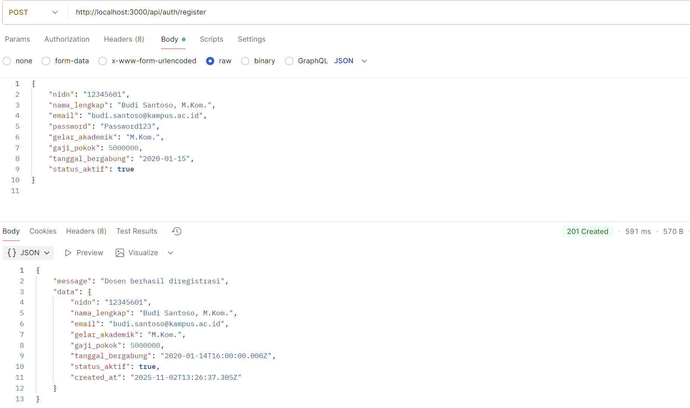
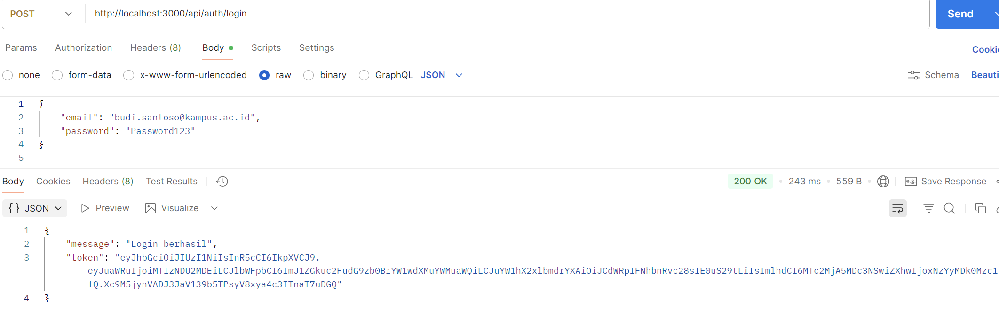
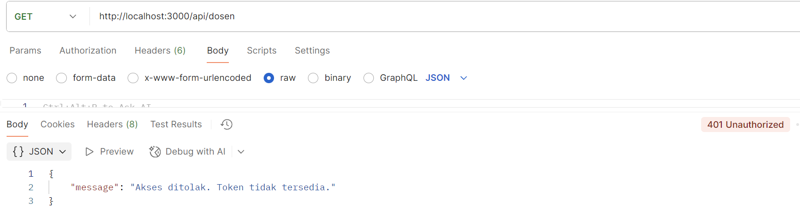
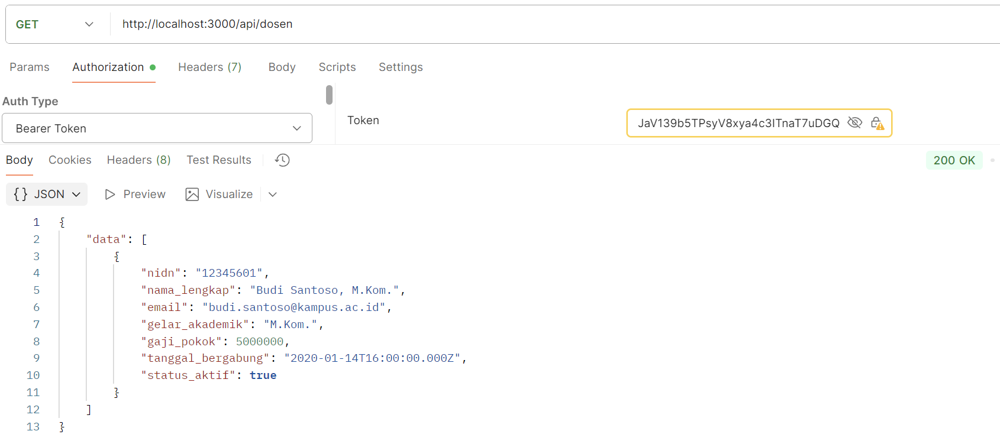
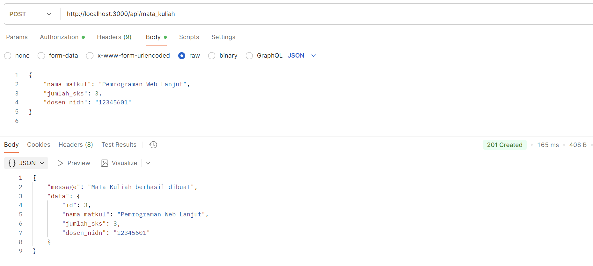

## Autentifikasi

Ini adalah proyek REST API sederhana yang dibuat menggunakan Express.js dan PostgreSQL. Proyek ini mengimplementasikan fungsionalitas CRUD (Create, Read, Update, Delete) untuk resource Dosen dan Mata Kuliah, serta dilengkapi dengan sistem autentikasi.

### Fitur Utama

RESTful API: Menyediakan endpoint API untuk mengelola data dosen dan mata kuliah.

Autentikasi & Otorisasi:

    Menggunakan JWT (JSON Web Token) untuk melindungi endpoint CRUD.

    Menggunakan bcrypt untuk hashing password dosen saat registrasi dan verifikasi saat login.

Arsitektur MVC: Kode diorganisir dengan jelas menggunakan pola Model-View-Controller.

Relasi Database: Mengimplementasikan relasi One-to-Many (satu Dosen bisa mengajar banyak Mata Kuliah).

Middleware: Menggunakan middleware kustom untuk:

Middleware: Menggunakan middleware kustom untuk:

    Logger: Mencatat setiap request yang masuk ke konsol.

    Validator: Memvalidasi data input (registrasi, login, CRUD).

    ErrorHandler: Menangani error secara terpusat.

    AuthMiddleware: Memverifikasi token JWT untuk melindungi route.

Konfigurasi .env: Menggunakan file .env untuk menyimpan kredensial database dan port server.

### Struktur Proyek

Proyek ini mengikuti struktur folder MVC standar untuk memisahkan tanggung jawab:

src/config: Berisi konfigurasi koneksi database PostgreSQL.

src/models: Bertanggung jawab untuk semua query dan logika database (SQL).

src/controllers: Bertindak sebagai "otak" yang mengelola alur request dan response.

    * dosenController.js & mataKuliahController.js: Mengelola alur CRUD.
    * authController.js: Mengelola logika register dan login.

src/routes: Mendefinisikan semua endpoint (URL) API.

    * dosenRoute.js & mataKuliahRoute.js: Mendefinisikan endpoint CRUD (terproteksi).

    * authRoutes.js: Mendefinisikan endpoint publik /auth/register dan /auth/login.

src/middleware:

    * logger.js, validator.js, errorHandler.js

    * authMiddleware.js: Berisi logika authenticateToken.

### Hasil Uji Coba (Screenshots)

Berikut adalah penjelasan untuk hasil uji coba yang dilakukan menggunakan Postman.

1. Registrasi Dosen Baru (Sukses)

POST /api/auth/register

Hasil pembuatan data dosen baru. Server merespons dengan status 201 Created dan mengembalikan data lengkap dosen yang baru dibuat berkat RETURNING *.

2. Login Dosen (Sukses)

POST /api/auth/login

Hasil mendapatkan token yang akan digunakan untuk routes yang terproteksi dengan autentifikasi setelah berhasil login dengan benar

3. Akses Route Terproteksi (Gagal - Tanpa Token)

GET /api/dosen (Read All)

Hasil gagal karena tidak menggunakan token di Header saat mengakses endpoint ini.

4.  Akses Route Terproteksi (Sukses - Dengan Token)

GET /api/dosen (Read All)

Berhasil mendapatkan data karena proses autentifikasi berhasil menggunakan token dari hasil login yang kemudian dimasukkan ke header

5. Akses Route Terproteksi Lain (POST Mata Kuliah)

POST /api/mata_kuliah

Hasil ini juga berhasil karena prosesnya mengikuti autentifikasi seperti poin 4.

